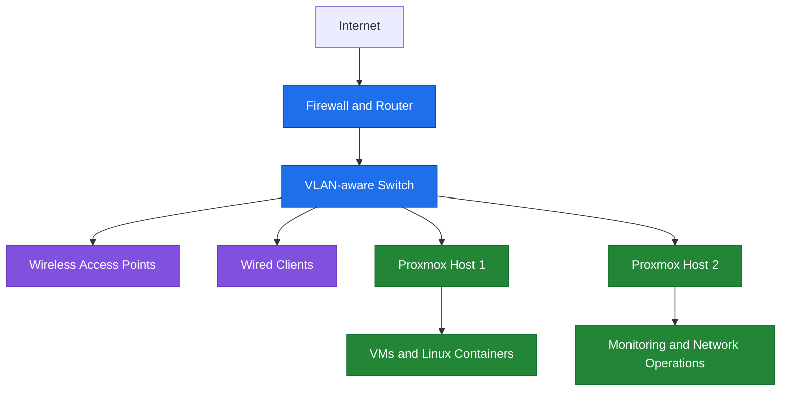

# My Networking & Homelab Portfolio

I built and operate this home infrastructure lab to develop practical experience in network design, firewall administration, virtualization, Linux operations, secure remote access, monitoring, and backup and recovery.

> **Privacy note:** I intentionally sanitize this public portfolio. Hostnames, public endpoints, internal addresses, SSIDs, physical locations, credentials, hardware identifiers, and other operational details have been replaced or omitted.

## Architecture at a glance

## What I built

- Segmented network zones for management, trusted clients, IoT, guests, and self-hosted services
- OPNsense-based routing and firewall policy with inter-VLAN access controls
- Cisco switching and TP-Link Omada wireless with VLAN-aware access and trunk links
- A two-node Proxmox VE environment hosting Linux containers, virtual machines, and administrative services
- WireGuard-based remote administration with no direct public exposure for management applications
- Monitoring, documented runbooks, local backups, encrypted off-site copies, and recovery procedures

## Technical focus

| Area | Skills demonstrated |
|---|---|
| Network engineering | VLAN segmentation, switch trunks and access ports, SSID-to-VLAN mapping, DHCP/DNS validation, and inter-VLAN routing |
| Security | OPNsense firewall policy, least-privilege design, IoT and guest isolation, WireGuard remote access, and management-plane protection |
| Systems administration | Proxmox VE, Linux LXC and VM workloads, Docker/Portainer, service lifecycle management, and persistent-data awareness |
| Reliability | Health checks, alerts, traffic visibility, backup retention, encrypted off-site copies, restoration planning, and incident documentation |
| Troubleshooting | Layered diagnosis across switching, routing, firewall policy, DHCP, virtualization, and application dependencies |

## Portfolio guide

### Design and operations

| Document | What it demonstrates |
|---|---|
| [Architecture overview](docs/architecture-overview.md) | My end-to-end infrastructure design and operational priorities |
| [Network segmentation](docs/network-segmentation.md) | VLANs, trust boundaries, and intended access between device classes |
| [Firewall policy](docs/firewall-policy.md) | Least-privilege design and inter-zone traffic control |
| [Wireless deployment](docs/wireless-deployment.md) | VLAN-aware AP uplinks, wireless trust zones, and validation procedures |
| [Secure remote access](docs/secure-remote-access.md) | WireGuard-based administration without exposing management interfaces publicly |
| [Virtualization platform](docs/virtualization-platform.md) | Proxmox VE, Linux workloads, service placement, and resilience planning |
| [Monitoring and operations](docs/monitoring-and-operations.md) | Availability checks, alerting, traffic visibility, and operational validation |
| [Service platform](docs/service-platform.md) | Workload lifecycle, service placement, and operational ownership |
| [Backup and recovery](docs/backup-and-recovery.md) | Backup retention, encrypted off-site copies, and restoration planning |

### Case studies

| Case study | What it demonstrates |
|---|---|
| [Proxmox management outage](case-studies/proxmox-management-outage.md) | Routing, firewall behavior, layered diagnosis, and recovery validation |
| [Corosync single-link dependency on a legacy network](case-studies/corosync-dual-link-migration.md) | Redundant link design, firewall policy gaps, phased migration, and zero-downtime verification |
| [Validating UPS failover under a real outage test](case-studies/ups-monitoring-validation.md) | Power monitoring instrumentation, tiered shutdown automation, controlled failure testing, and evidence-based capacity planning |
| [BPDU Guard on an AP trunk](case-studies/bpduguard-ap-trunk-outage.md) | Cisco switching protections, trunk design, and error-disabled interface recovery |
| [DHCP service port conflict](case-studies/dhcp-port-conflict.md) | Socket ownership, service migration, DHCP validation, and root-cause analysis |
| [ISP router to firewall cutover](case-studies/isp-firewall-cutover.md) | Edge-network migration planning, execution, validation, and rollback awareness |

### Sanitized examples

| Example | What it demonstrates |
|---|---|
| [Cisco IOS VLAN and port templates](examples/cisco-switch-baseline-template.md) | VLANs, endpoint access ports, restricted trunks, and unused-port handling |
| [Proxmox VLAN-aware bridge template](examples/proxmox-vlan-aware-bridge-template.md) | VLAN-aware bridge configuration and guest network placement |
| [WireGuard client template](examples/wireguard-client-template.conf) | Placeholder-only client configuration and least-privilege routing |

## Technology used

OPNsense · Cisco IOS switching · TP-Link Omada · Proxmox VE · Debian/Ubuntu/Alpine Linux · WireGuard · Docker/Portainer · Uptime Kuma · rclone · Git/GitHub

## Operating principles

1. I segment devices by trust and purpose rather than treating the LAN as one flat network.
2. I keep administrative services off the public internet.
3. I document changes, validate them, and retain enough recovery information to rebuild after a failure.
4. I prefer simple, observable designs that I can realistically maintain in a home environment.
