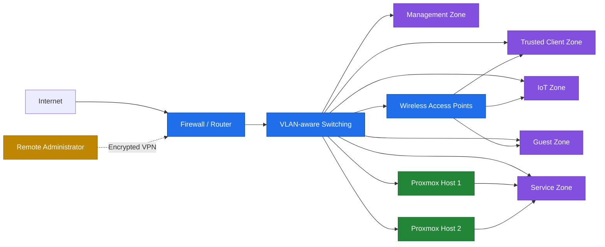

# Sanitized Network Topology

This diagram represents the portfolio's logical architecture. It intentionally omits real hostnames, addresses, endpoints, SSIDs, physical locations, hardware identifiers, and management paths.

## Design notes

- The firewall routes traffic between zones and enforces inter-zone access policy.
- Management interfaces are separated from routine client and service traffic.
- Wireless SSIDs map clients into trusted, IoT, or guest zones.
- Proxmox guests are placed in the network zone that matches their role.
- Remote administration uses an authenticated VPN path rather than direct public access to management interfaces.
- Client, service, and management access is governed by least-privilege policy.